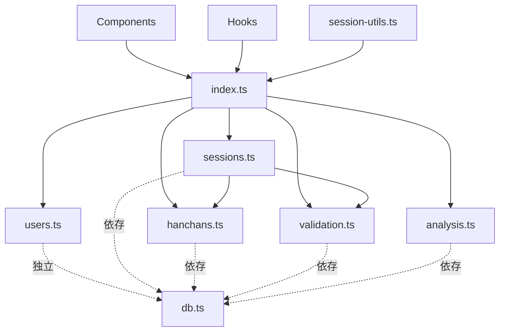

# db-utils.ts リファクタリング計画書

**作成日:** 2025-10-09 16:44
**対象ファイル:** `app/src/lib/db-utils.ts` (1,380行)
**目的:** デバッグログの統一 → ドメイン別モジュール分割

---

## 📋 目次

1. [現状分析](#現状分析)
2. [Phase 1: デバッグログ統一](#phase-1-デバッグログ統一)
3. [Phase 2: ドメイン別分割](#phase-2-ドメイン別分割)
4. [Phase 3: 統合テストと検証](#phase-3-統合テストと検証)
5. [リスク管理](#リスク管理)
6. [実施スケジュール](#実施スケジュール)

---

## 現状分析

### ファイル構成
- **総行数:** 1,380行
- **console.log使用:** 12箇所（全てデバッグログ）
- **logger使用:** 多数（INFO, WARN, ERROR）
- **主要セクション:**
  - 型定義（UI Layer Types, Analysis Types）
  - User Functions
  - Session Functions
  - Hanchan Functions
  - PlayerResult Functions
  - Validation Functions
  - Complex Query Functions
  - Data Conversion Functions
  - Session Save Functions
  - Analysis Functions (Phase 5)
  - Filter Functions (Phase 5-2)

### 問題点

#### 1. デバッグログの不統一
**場所:**
- L861, L872, L891, L895, L905, L913: `saveSession`関数内
- L1028, L1043, L1058, L1064, L1094, L1116: `updateSession`関数内

**問題:**
- 直接`console.log`使用 → loggerシステムをバイパス
- コンテキスト情報なし
- 本番環境で非表示にならない（DEVモードチェックなし）
- ログフォーマットが他と不一致

**影響範囲:** 2関数（`saveSession`, `updateSession`）

#### 2. ファイルサイズの肥大化
- 1,380行 → 単一責任原則(SRP)違反
- ナビゲーション困難
- テストが書きにくい
- マージコンフリクト発生リスク高

---

## Phase 1: デバッグログ統一

**目標:** 全てのconsole.logをloggerシステムに置き換え

### 1.1 対象箇所の特定 ✅

| 行番号 | 関数名 | 現在のログ内容 |
|--------|--------|--------------|
| 861 | `saveSession` | `半荘${hanchanNumber}を保存開始` |
| 872 | `saveSession` | `半荘${hanchanNumber}のHanchanレコード保存完了` |
| 891 | `saveSession` | `半荘${hanchanNumber}のPlayerResults保存完了` |
| 895 | `saveSession` | `半荘${hanchanNumber}のゼロサム検証` |
| 905 | `saveSession` | `半荘${hanchanNumber}のウママーク検証` |
| 913 | `saveSession` | `半荘${hanchanNumber}の保存完了` |
| 1028 | `updateSession` | `既存半荘数=${existingHanchans.length}` |
| 1043 | `updateSession` | `既存データ削除完了` |
| 1058 | `updateSession` | `セッション設定更新完了` |
| 1064 | `updateSession` | `半荘${hanchanNumber}を作成開始` |
| 1094 | `updateSession` | `半荘${hanchanNumber}作成完了` |
| 1116 | `updateSession` | `トランザクション完了` |

### 1.2 変換方針

#### Before (現状)
```typescript
console.log(`[DEBUG] 半荘${hanchanData.hanchanNumber}を保存開始`);
```

#### After (統一後)
```typescript
logger.debug('半荘保存開始', {
  context: 'db-utils.saveSession',
  data: { hanchanNumber: hanchanData.hanchanNumber }
});
```

### 1.3 実装手順

**Step 1.1: Import文の確認**
- `logger`が既にインポート済みか確認 ✅（確認済み: L2）

**Step 1.2: 各console.logの置き換え**

| 優先度 | 行番号 | 置き換えコード |
|--------|--------|--------------|
| 1 | 861 | `logger.debug('半荘保存開始', { context: 'db-utils.saveSession', data: { hanchanNumber: hanchanData.hanchanNumber } })` |
| 2 | 872 | `logger.debug('Hanchanレコード保存完了', { context: 'db-utils.saveSession', data: { hanchanNumber: hanchanData.hanchanNumber } })` |
| 3 | 891 | `logger.debug('PlayerResults保存完了', { context: 'db-utils.saveSession', data: { hanchanNumber: hanchanData.hanchanNumber, playerCount: hanchanData.players.length } })` |
| 4 | 895 | `logger.debug('ゼロサム検証完了', { context: 'db-utils.saveSession', data: { hanchanNumber: hanchanData.hanchanNumber, isValid: isZeroSum } })` |
| 5 | 905 | `logger.debug('ウママーク検証完了', { context: 'db-utils.saveSession', data: { hanchanNumber: hanchanData.hanchanNumber, isValid: isUmaValid } })` |
| 6 | 913 | `logger.debug('半荘保存完了', { context: 'db-utils.saveSession', data: { hanchanNumber: hanchanData.hanchanNumber } })` |
| 7 | 1028 | `logger.debug('既存半荘取得完了', { context: 'db-utils.updateSession', data: { count: existingHanchans.length } })` |
| 8 | 1043 | `logger.debug('既存データ削除完了', { context: 'db-utils.updateSession' })` |
| 9 | 1058 | `logger.debug('セッション設定更新完了', { context: 'db-utils.updateSession' })` |
| 10 | 1064 | `logger.debug('半荘作成開始', { context: 'db-utils.updateSession', data: { hanchanNumber: hanchanData.hanchanNumber } })` |
| 11 | 1094 | `logger.debug('半荘作成完了', { context: 'db-utils.updateSession', data: { hanchanNumber: hanchanData.hanchanNumber } })` |
| 12 | 1116 | `logger.debug('トランザクション完了', { context: 'db-utils.updateSession' })` |

**Step 1.3: 動作確認**
- Dev環境でセッション保存操作を実行
- ブラウザコンソールでログ出力を確認
- ログフォーマットが`[DEBUG][db-utils.saveSession] メッセージ`形式になることを確認

### 1.4 成果物

- ✅ 統一されたログフォーマット
- ✅ コンテキスト情報付与
- ✅ DEVモードでのみ表示（本番では非表示）
- ✅ トレーサビリティ向上

### 1.5 所要時間

**推定:** 30分
- 置き換え作業: 15分
- 動作確認: 10分
- ドキュメント更新: 5分

---

## Phase 2: ドメイン別分割

**目標:** 1,380行のdb-utils.tsを5つのドメインモジュールに分割

### 2.1 分割設計

#### 新ディレクトリ構造
```
src/lib/db/
  ├── index.ts              # 公開API（Re-export）
  ├── users.ts              # ユーザー管理（約200行）
  ├── sessions.ts           # セッション管理（約300行）
  ├── hanchans.ts           # 半荘・プレイヤー結果（約250行）
  ├── analysis.ts           # 分析統計（約350行）
  └── validation.ts         # バリデーション・検証（約150行）
```

### 2.2 各モジュールの責務

#### 📁 **users.ts** (約200行)

**責務:** ユーザーCRUD操作、アーカイブシステム

**移行対象関数:**
- `getMainUser()` (L126-152)
- `getAllUsers()` (L157-159)
- `getRegisteredUsers()` (L164-167)
- `addUser()` (L172-216)
- `updateUser()` (L221-275)
- `archiveUser()` (L281-331)
- `restoreUser()` (L337-384)
- `getActiveUsers()` (L389-403)
- `getArchivedUsers()` (L408-422)
- `deleteUser()` (L428-436) [Deprecated]

**依存関係:**
- Import: `db`, `User`, `logger`, `DatabaseError`, `ValidationError`, `NotFoundError`
- Export: 上記全関数

---

#### 📁 **sessions.ts** (約300行)

**責務:** セッションCRUD、保存・更新・削除ロジック

**移行対象関数:**
- `createSession()` (L445-464)
- `getSessionsByDate()` (L469-474)
- `getAllSessions()` (L479-484)
- `saveSession()` (L795-933)
- `deleteSession()` (L939-986)
- `updateSession()` (L1000-1140)
- `sessionToSettings()` (L665-673)
- `dbHanchansToUIHanchans()` (L681-700)
- `uiDataToSaveData()` (L709-735)
- `isEmptyHanchan()` (L786-790) [Private helper]

**型定義:**
- `SessionSaveData` (L744-764)
- `UIHanchan` (L17-21)
- `UIPlayerResult` (L29-38)

**依存関係:**
- Import: `db`, `Session`, `Hanchan`, `PlayerResult`, `SessionSettings`, `logger`, エラークラス
- Import from: `./validation` (validateZeroSum, validateUmaMarks)
- Import from: `./hanchans` (createHanchan, createPlayerResult)
- Export: 上記全関数 + 型定義

---

#### 📁 **hanchans.ts** (約250行)

**責務:** 半荘・プレイヤー結果のCRUD、複雑なクエリ

**移行対象関数:**
- `createHanchan()` (L493-507)
- `getHanchansBySession()` (L512-517)
- `createPlayerResult()` (L526-549)
- `getPlayerResultsByHanchan()` (L554-562)
- `getSessionWithDetails()` (L608-628)
- `getUserStats()` (L633-655)

**依存関係:**
- Import: `db`, `Hanchan`, `PlayerResult`, `logger`, エラークラス
- Export: 上記全関数

---

#### 📁 **validation.ts** (約150行)

**責務:** ビジネスルール検証（ゼロサム、ウママーク）

**移行対象関数:**
- `validateZeroSum()` (L571-581)
- `validateUmaMarks()` (L586-599)

**依存関係:**
- Import: `db`, `PlayerResult`, `umaMarkToValue` (from `../uma-utils`)
- Export: 上記全関数

---

#### 📁 **analysis.ts** (約350行)

**責務:** 分析統計計算、フィルタリング

**移行対象型:**
- `PeriodType` (L47-51)
- `AnalysisFilter` (L56-60)
- `RankStatistics` (L65-80)
- `RevenueStatistics` (L85-89)
- `PointStatistics` (L94-98)
- `ChipStatistics` (L103-107)
- `AnalysisStatistics` (L112-117)

**移行対象関数:**
- `calculateRanksFromScores()` (L1150-1168) [Private helper]
- `calculateRankStatistics()` (L1178-1251)
- `calculateRevenueStatistics()` (L1256-1275)
- `calculatePointStatistics()` (L1280-1305)
- `calculateChipStatistics()` (L1310-1329)
- `filterSessionsByPeriod()` (L1338-1367)
- `filterSessionsByMode()` (L1372-1380)

**依存関係:**
- Import: `db`, `PlayerResult`, `GameMode`
- Export: 上記全型 + 全関数

---

#### 📁 **index.ts** (約30行)

**責務:** 公開APIの統一エクスポート（Re-export）

**内容:**
```typescript
// ユーザー管理
export {
  getMainUser,
  getAllUsers,
  getRegisteredUsers,
  addUser,
  updateUser,
  archiveUser,
  restoreUser,
  getActiveUsers,
  getArchivedUsers,
  deleteUser
} from './users';

// セッション管理
export {
  createSession,
  getSessionsByDate,
  getAllSessions,
  saveSession,
  deleteSession,
  updateSession,
  sessionToSettings,
  dbHanchansToUIHanchans,
  uiDataToSaveData
} from './sessions';
export type { SessionSaveData, UIHanchan, UIPlayerResult } from './sessions';

// 半荘・プレイヤー結果
export {
  createHanchan,
  getHanchansBySession,
  createPlayerResult,
  getPlayerResultsByHanchan,
  getSessionWithDetails,
  getUserStats
} from './hanchans';

// バリデーション
export {
  validateZeroSum,
  validateUmaMarks
} from './validation';

// 分析統計
export {
  calculateRankStatistics,
  calculateRevenueStatistics,
  calculatePointStatistics,
  calculateChipStatistics,
  filterSessionsByPeriod,
  filterSessionsByMode
} from './analysis';
export type {
  PeriodType,
  AnalysisFilter,
  RankStatistics,
  RevenueStatistics,
  PointStatistics,
  ChipStatistics,
  AnalysisStatistics
} from './analysis';
```

### 2.3 分割実施手順

#### Step 2.1: ディレクトリ作成
```bash
mkdir -p src/lib/db
```

#### Step 2.2: validation.ts作成（依存なし、最初に作成）
1. `validation.ts`新規作成
2. `validateZeroSum`, `validateUmaMarks`をコピー
3. Import文調整（`umaMarkToValue`は`../uma-utils`から）
4. Export追加

#### Step 2.3: hanchans.ts作成（validationに依存）
1. `hanchans.ts`新規作成
2. 半荘・プレイヤー結果関数をコピー
3. Import文調整
4. Export追加

#### Step 2.4: analysis.ts作成（依存なし）
1. `analysis.ts`新規作成
2. 分析関数と型定義をコピー
3. `calculateRanksFromScores`をprivate helperとして保持
4. Import文調整
5. Export追加

#### Step 2.5: sessions.ts作成（validation, hanchansに依存）
1. `sessions.ts`新規作成
2. セッション関連関数と型定義をコピー
3. Import文調整（`./validation`, `./hanchans`から必要な関数をimport）
4. Export追加

#### Step 2.6: users.ts作成（依存なし）
1. `users.ts`新規作成
2. ユーザー管理関数をコピー
3. Import文調整
4. Export追加

#### Step 2.7: index.ts作成（Re-export）
1. `index.ts`新規作成
2. 全モジュールからRe-export
3. 公開APIとして機能確認

#### Step 2.8: Import文の一括置換
元のimport文を新しいパスに置換:

**Before:**
```typescript
import { getMainUser, addUser, ... } from '@/lib/db-utils';
```

**After:**
```typescript
import { getMainUser, addUser, ... } from '@/lib/db';
```

**対象ファイル:**
- `src/hooks/useUsers.ts`
- `src/hooks/useSessions.ts`
- `src/components/**/*.tsx` (全コンポーネント)
- `src/lib/session-utils.ts`

**置換コマンド:**
```bash
# 全ファイルでimport文を一括置換（プレビュー）
grep -r "from '@/lib/db-utils'" src/ --include="*.ts" --include="*.tsx"

# 実際の置換（sedまたは手動）
find src/ -type f \( -name "*.ts" -o -name "*.tsx" \) -exec sed -i '' "s|from '@/lib/db-utils'|from '@/lib/db'|g" {} +
```

#### Step 2.9: 旧db-utils.ts削除
```bash
# バックアップ作成
cp src/lib/db-utils.ts _old_files/backup_20251009_1700/db-utils.ts

# 削除
rm src/lib/db-utils.ts
```

### 2.4 依存関係図



### 2.5 所要時間

| ステップ | 推定時間 |
|---------|---------|
| 2.1 ディレクトリ作成 | 5分 |
| 2.2 validation.ts作成 | 20分 |
| 2.3 hanchans.ts作成 | 30分 |
| 2.4 analysis.ts作成 | 40分 |
| 2.5 sessions.ts作成 | 50分 |
| 2.6 users.ts作成 | 30分 |
| 2.7 index.ts作成 | 15分 |
| 2.8 Import文置換 | 20分 |
| 2.9 旧ファイル削除 | 5分 |
| **合計** | **3時間35分** |

---

## Phase 3: 統合テストと検証

### 3.1 動作確認項目

#### ✅ **ユーザー管理**
- [ ] メインユーザー取得
- [ ] 新規ユーザー追加
- [ ] ユーザー名変更
- [ ] ユーザーアーカイブ
- [ ] ユーザー復元

#### ✅ **セッション管理**
- [ ] 新規セッション保存
- [ ] セッション一覧取得
- [ ] セッション詳細表示
- [ ] セッション編集
- [ ] セッション削除

#### ✅ **分析機能**
- [ ] 着順統計表示
- [ ] 収支統計表示
- [ ] ポイント統計表示
- [ ] チップ統計表示
- [ ] 期間フィルター
- [ ] モードフィルター

### 3.2 ビルド確認

```bash
# TypeScriptコンパイル
npm run build

# Lint実行
npm run lint

# 型チェック
npx tsc --noEmit
```

### 3.3 回帰テスト

**手動テストシナリオ:**

1. **新規入力タブ**
   - セッション設定入力 → 半荘入力 → 保存
   - ログ出力確認（DEBUGログが正しいフォーマットで出力されているか）

2. **履歴タブ**
   - セッション一覧表示
   - セッション詳細表示
   - セッション削除

3. **分析タブ**
   - 統計表示
   - フィルター動作
   - グラフ描画

4. **設定タブ**
   - ユーザー追加
   - ユーザー名変更
   - ユーザーアーカイブ/復元

### 3.4 パフォーマンス確認

- セッション保存時間測定（分割前 vs 分割後）
- バンドルサイズ確認（Viteビルド結果）
- 初回ロード時間測定

### 3.5 所要時間

**推定:** 1時間30分
- ビルド確認: 10分
- 回帰テスト: 60分
- パフォーマンス確認: 20分

---

## リスク管理

### 🔴 **高リスク**

#### R1: Import文の置換漏れ
**発生確率:** 中
**影響:** コンパイルエラー、実行時エラー

**緩和策:**
- 置換前に全Import文をgrepで抽出・確認
- TypeScriptコンパイルで検出
- 段階的に1ファイルずつ確認

#### R2: 循環依存の発生
**発生確率:** 低
**影響:** コンパイルエラー

**緩和策:**
- 依存関係図に従った順序で作成
- validation.ts → hanchans.ts → sessions.tsの順で作成
- 各モジュール作成後に即座にビルド確認

### 🟡 **中リスク**

#### R3: 型定義の重複・欠落
**発生確率:** 中
**影響:** TypeScriptエラー

**緩和策:**
- 型定義は適切なモジュールに配置
- Re-exportで公開APIを統一
- `npx tsc --noEmit`で型チェック

#### R4: 動作検証の不足
**発生確率:** 低
**影響:** バグの見逃し

**緩和策:**
- Phase 3で包括的な動作確認
- 主要フローの手動テスト実施

### 🟢 **低リスク**

#### R5: パフォーマンスの劣化
**発生確率:** 極低
**影響:** わずかなパフォーマンス低下

**緩和策:**
- Viteのツリーシェイキングが自動的に最適化
- バンドルサイズ確認で検証

---

## 実施スケジュール

### 📅 **推奨実施タイミング**

**総所要時間:** 5時間35分

| Phase | 作業内容 | 所要時間 | 累積時間 |
|-------|---------|---------|---------|
| Phase 1 | デバッグログ統一 | 30分 | 30分 |
| **休憩** | | 10分 | 40分 |
| Phase 2 (前半) | validation, hanchans, analysis作成 | 1時間30分 | 2時間10分 |
| **休憩** | | 10分 | 2時間20分 |
| Phase 2 (後半) | sessions, users, index作成 + Import置換 | 2時間5分 | 4時間25分 |
| **休憩** | | 10分 | 4時間35分 |
| Phase 3 | テストと検証 | 1時間30分 | 6時間5分 |

### 📌 **マイルストーン**

- ✅ **M1: Phase 1完了** - デバッグログ統一完了、動作確認OK
- ✅ **M2: Phase 2完了** - 分割完了、ビルド成功
- ✅ **M3: Phase 3完了** - 全テスト合格、本番デプロイ準備完了

### 🚀 **実施推奨日**

- **1日で完了:** 集中して5-6時間確保
- **2日に分割:** Phase 1-2（4時間） + Phase 3（1.5時間）

---

## チェックリスト

### Phase 1: デバッグログ統一
- [ ] console.log 12箇所を特定
- [ ] logger.debugに置き換え（コンテキスト付与）
- [ ] Dev環境で動作確認
- [ ] ログフォーマット確認

### Phase 2: ドメイン別分割
- [ ] `src/lib/db/`ディレクトリ作成
- [ ] `validation.ts`作成・動作確認
- [ ] `hanchans.ts`作成・動作確認
- [ ] `analysis.ts`作成・動作確認
- [ ] `sessions.ts`作成・動作確認
- [ ] `users.ts`作成・動作確認
- [ ] `index.ts`作成（Re-export）
- [ ] Import文一括置換
- [ ] TypeScriptコンパイル成功
- [ ] 旧`db-utils.ts`バックアップ・削除

### Phase 3: 統合テストと検証
- [ ] ビルド成功（`npm run build`）
- [ ] Lint合格（`npm run lint`）
- [ ] 型チェック合格（`npx tsc --noEmit`）
- [ ] ユーザー管理機能確認
- [ ] セッション管理機能確認
- [ ] 分析機能確認
- [ ] パフォーマンス計測
- [ ] MASTER_STATUS_DASHBOARD.md更新

---

## 成果物

### ドキュメント
- ✅ `01-REFACTORING_PLAN.md`（本ドキュメント）
- 📄 `02-IMPLEMENTATION_LOG.md`（実施時に作成）
- 📄 `03-TEST_RESULTS.md`（テスト結果記録）

### コード
- 📁 `src/lib/db/` ディレクトリ
  - `users.ts`
  - `sessions.ts`
  - `hanchans.ts`
  - `analysis.ts`
  - `validation.ts`
  - `index.ts`

### バックアップ
- 📄 `_old_files/backup_20251009_1700/db-utils.ts`

---

## 参考資料

- [コード分析レポート](../../MASTER_STATUS_DASHBOARD.md) - 2025-10-09実施
- [Phase 4実装ドキュメント](../2025-10-04-phase4-history-tab/)
- [Phase 5実装ドキュメント](../2025-10-05-phase5-analysis-tab/)

---

**最終更新:** 2025-10-09 16:44
**ステータス:** 計画完了、実装待ち
**次のアクション:** Phase 1実装開始
